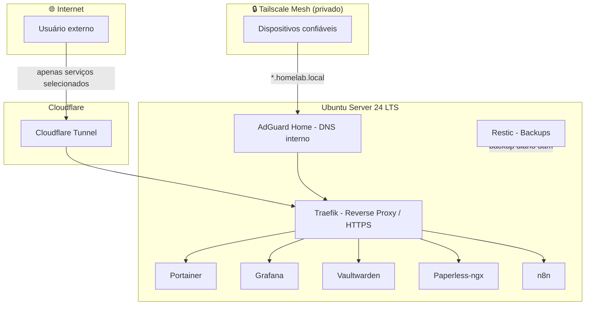

# 🏠 Homelab Infra

Infraestrutura self-hosted rodando em produção (uso pessoal) em um Ubuntu Server 24 LTS — construída como laboratório prático contínuo de infraestrutura, redes, containers e automação.

Esse repositório documenta a arquitetura, as decisões técnicas e os principais "gotchas" resolvidos no caminho. Os arquivos de configuração aqui são **exemplos sanitizados** — sem IPs reais, domínios reais ou segredos.

---

## 🎯 Objetivo do projeto

Manter, sozinho, uma stack completa de infraestrutura que normalmente é operada por um time:

- Acesso remoto seguro sem abrir portas no roteador (VPN mesh)
- Exposição pública seletiva e controlada de serviços específicos (tunnel, não port-forward)
- Reverse proxy com HTTPS automático
- Orquestração de containers
- Observabilidade (métricas e dashboards)
- Backups automatizados e testáveis
- DNS interno próprio

Tudo isso virou também a base prática da minha transição para Infraestrutura Cloud / CloudOps — boa parte dos conceitos aqui (redes, containers, automação, observabilidade) são os mesmos cobrados nas certificações AWS que estou cursando.

---

## 🏗️ Arquitetura



**Dois caminhos de acesso, por desenho:**

- **Privado (Tailscale):** dispositivos confiáveis entram na mesh VPN e resolvem os serviços internos via AdGuard Home (`*.homelab.local`), tudo dentro do túnel criptografado. É o caminho padrão pro dia a dia.
- **Público (Cloudflare Tunnel):** só os serviços que realmente precisam ser alcançáveis de fora (ex: webhooks de automação) são expostos, via túnel outbound — nenhuma porta fica aberta no roteador em nenhum dos dois casos.

---

## 🧱 Stack

| Componente | Função |
|---|---|
| Ubuntu Server 24 LTS | Sistema operacional base |
| Docker + Docker Compose | Runtime e orquestração de containers |
| Traefik | Reverse proxy com HTTPS automático e roteamento por domínio |
| Portainer | Gestão visual dos containers |
| Tailscale | VPN mesh para acesso privado, sem expor portas |
| Cloudflare Tunnel | Exposição pública seletiva, sem port-forward |
| AdGuard Home | DNS interno com wildcard para `*.homelab.local` |
| Grafana | Observabilidade e dashboards |
| Vaultwarden | Gerenciador de senhas self-hosted (compatível com Bitwarden) |
| Paperless-ngx | Gestão e OCR de documentos |
| Restic | Backups automatizados e criptografados |
| n8n | Automação de workflows (também usado em projetos de automação à parte) |

---

## 🔧 Decisões técnicas e troubleshooting

### Conflito de DNS: systemd-resolved vs Tailscale

O `systemd-resolved` do Ubuntu disputa com o MagicDNS do Tailscale pelo slot de resolver padrão, causando resolução inconsistente de nomes internos. Resolvido assim:

- `Domains=~.` configurado na interface do Tailscale, fazendo o `systemd-resolved` tratar o Tailscale como autoritativo para todos os domínios.
- `/etc/resolv.conf` travado com `chattr +i`, impedindo que outros processos sobrescrevam a configuração no boot.
- Tailscale rodando com `--accept-dns=false`, deixando a resolução de fato a cargo do AdGuard Home (e não brigando por essa responsabilidade).

### Permissões de container — nunca `chown -R` global

Lição cara de aprender: rodar `chown -R` na pasta de apps inteira quebra serviços que esperam UID/GID específicos dentro do container. A solução foi mapear a permissão correta **por serviço**:

- Grafana → `472:472`
- Prometheus → `65534:65534` (usuário `nobody`)
- Demais serviços → `1000:1000`

### Backups

Restic rodando via cron diário (3h da manhã), com `sudo -E` para preservar as variáveis de ambiente necessárias (senha do repositório de backup). Backups incrementais e criptografados dos volumes persistentes.

---

## 📂 Estrutura deste repositório

```
homelab-infra/
├── README.md
├── docker-compose.example.yml   # exemplo sanitizado da stack principal
└── docs/
    └── architecture.md          # detalhes adicionais de arquitetura
```

---

## 🚧 Próximos passos

- [ ] Migrar provisionamento manual para **Terraform** (em estudo, parte da trilha de certificação AWS)
- [ ] Pipeline simples de CI com GitHub Actions para validar configs antes do deploy
- [ ] Expandir dashboards de observabilidade no Grafana

---

## ⚠️ Nota

Este é um laboratório pessoal de aprendizado contínuo. Os arquivos de configuração neste repositório são exemplos sanitizados — sem IPs, domínios ou credenciais reais.
